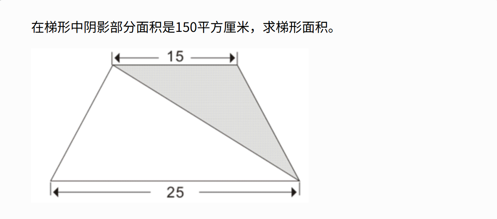

# 题目标题：[2061：例1.2】梯形面积]

## 时间限制: 1000 ms   内存限制: 65536 KB

## 题目难度：⭐

## 算法标签：[几何、面积计算、C++ 基础]

## 【题目描述】

## 【输入】

(无）

## 【输出】

输出梯形面积（保留两位小数）。

## 【输入样例】

(无）

## 【输出样例】

(无）

## 🧠 解题思路

1. 步骤一：阴影部分为三角形，已知其面积为150平方厘米，底为15厘米（梯形上底）。根据三角形面积公式 $ S = \frac{1}{2} \times 底 \times 高 $，可计算出三角形的高，即梯形的高。
2. 步骤二：梯形的上底为15厘米，下底为25厘米，利用梯形面积公式 $ S = \frac{(上底 + 下底) \times 高}{2} $，代入计算得到梯形面积。
3. 步骤三：将结果保留两位小数输出。

## 📝 总结

1. **`fixed`：固定小数点输出格式**  
   - 作用：将浮点数的输出格式从科学计数法（如 `1.23e+02`）改为固定小数形式（如 `123.00`）。  
   - 原理：`fixed` 是 `ios` 类的操纵符，它会强制浮点数以“整数部分 + 小数部分”的形式显示，避免科学计数法的缩写。  
   - 示例：若 `area = 123.456`，默认输出可能是 `1.23456e+02`；使用 `fixed` 后，输出变为 `123.456`（后续通过 `setprecision` 控制小数位数）。
2. **`setprecision(2)`：设置小数位数**  
   - 作用：指定浮点数输出时小数点后保留的位数（当结合 `fixed` 时）。  
   - 注意：若未使用 `fixed`，`setprecision(n)` 会控制有效数字位数（如 `setprecision(2)` 会将 `123.456` 输出为 `1.2e+02`）；但结合 `fixed` 后，`setprecision(2)` 会严格保留小数点后2位。  
   - 示例：若 `area = 123.456`，`fixed << setprecision(2)` 会输出 `123.46`（四舍五入）；若 `area = 123`，输出为 `123.00`（补零）。
